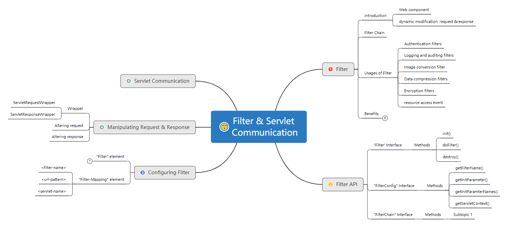

# login_verification
> 对用户登陆状态进行检查，实现URL级别的权限访问控制

## Table of contents
* [General info](#general-info)
* [Setup](#setup)
* [Core Concepts](#core-concepts)
* [Status](#status)
* [Inspiration](#inspiration)


## General info
> Filter也称之为过滤器，它是Servlet技术中最激动人心的技术
> 对web服务器管理的所有web资源：例如Jsp, Servlet, 静态图片文件或静态
> html
> 文件等进行拦截，从而实现一些特殊的功能。例如**实现URL级别的权限访问控制、过滤敏感词汇、压缩响应信息等一些高级功能**。

<!--Filter接口中有一个doFilter方法，当我们编写好Filter，并配置对哪个web资源进行拦截后，WEB服务器每次在调用web资源的service方法之前，都会先调用一下filter的doFilter方法，因此，在该方法内编写代码可达到如下目的：-->

<!--1. 调用目标资源之前，让一段代码执行。
2. 是否调用目标资源（即是否让用户访问web资源）。
3. 调用目标资源之后，让一段代码执行。
4. web服务器在调用doFilter方法时，会传递一个filterChain对象进来，filterChain对象是filter接口中最重要的一个对象，它也提供了一个doFilter方法，开发人员可以根据需求决定是否调用此方法，调用该方法，则web服务器就会调用web资源的service方
   法，即web资源就会被访问，否则web资源不会被访问。-->


## Setup
Two ways to set up：
* way 1 - External Tomcat to run idea j,lygkhnoio my
  要将mapper.xml文件放到resource文件夹中，否则无法打包

* way 2 - Maven Tomcat plugins
  用maven的插件进行打包，打包命令如下,主要是要注意将mapper下面的xml文件打包
  ```
   <plugin>
                <groupId>org.apache.tomcat.maven</groupId>
                <artifactId>tomcat7-maven-plugin</artifactId>
                <version>2.2</version>
                <configuration>
                    <port>8888</port>
                </configuration>
            </plugin>
            <plugin>
                <artifactId>maven-resources-plugin</artifactId>
                <version>2.5</version>
                <executions>
                    <execution>
                        <id>copy-xmls</id>
                        <phase>process-sources</phase>
                        <goals>
                            <goal>copy-resources</goal>
                        </goals>
                        <configuration>
                            <outputDirectory>${basedir}/target/classes</outputDirectory>
                            <resources>
                                <resource>
                                    <directory>${basedir}/src/main/java</directory>
                                    <includes>
                                        <include>**/*.xml</include>
                                    </includes>
                                </resource>
                            </resources>
                        </configuration>
                    </execution>
                </executions>
            </plugin>
        </plugins>
  
  ```

## Core Concepts
Show examples of usage:



## Status
Project is: _in progress_

## Inspiration
Add here credits. Project inspired by..., based on...

## References & Future Resources
1. [Filter(过滤器)学习](https://www.cnblogs.com/xdp-gacl/p/3948353.html)
2. [Java Web之过滤器](https://www.imooc.com/video/4479)

